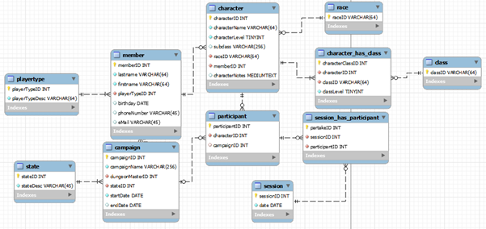

# Database-Project
A MySQL database project done for a school course. No actual club is involved, it's just something fun we thought of for the course's final project.  

# Database for a Dungeons and Dragons Club  

Team Name: Dungeon Engineers  
Members: Joni Oranne, Joonas Peltomäki  
Version Number: 1.0  
Date: 27.03.2024  

## Introduction  

We are creating a database for a D&D club, similar to the Adventurer’s League, to store the club's history: past game sessions, player characters, members, past and current campaigns, and their Dungeon Masters and players.
The goal is to store all essential character information, such as race, class, level, name, and subclass. The database will be used by the club's leaders and Dungeon Masters.

It must be possible to log session dates, attending players, the DM, and the campaign being played. Updates occur when members leave or join the club, players join campaigns, characters change, etc.
Updates can be done as frequently as events happen or, for example, once a week, depending on the diligence of the club leaders and Dungeon Masters. There will likely be 1-20 updates per week.

The practical goal is to keep track of all essential club activities.

## Division of Work  

The database structure (ER diagram) was created together, with the workload split equally. The project was worked on collaboratively for about 12 hours.
A major success was that the database structure almost perfectly resembled the final result on the first attempt, and forward engineering worked successfully on the first try.
Another success was that data entry succeeded on the first attempt every time. Overall, the workflow went surprisingly smoothly, and the database structure is quite optimal.
The character deletion trigger was collaboratively developed (fig 8).

On the downside, the source code is not commented. However, it was created using forward engineering, and SQL languages are generally quite readable.

**Joni**  
Role: In addition to refining the database structure, I devised the solution for allowing characters to have multiple classes.
I populated the playertype, participant, character, character_has_class, race, class, and state tables.
I wrote the campaignInfo view's code (fig 3). For the documentation I explained the principles of database operation, justified design decisions, and described the views.

**Joonas**  
Role: I designed the core campaign-participant-character-member-campaign loop that enables displaying both the Dungeon Master
and all players of a campaign simultaneously. I populated the member, campaign, session (58 rows), and session_has_participant (260 rows) tables.
Additionally, I created the following views: members (fig 7), allCharacters (fig 4), and sessions (fig 6).

## Overview  

MySQL Workbench is used to create the database and manipulate its contents.  

**Features**  

Mandatory:  

* Club members (name, age, phone number, email)  
* Player characters and their key details  
* Whether the individual is a player, Dungeon Master, both, or inactive  
* Logging game sessions  
* Campaign details (name, campaign Dungeon Master, and players)  

## Additional Features  

Performance: Response time is not critical as the database is updated at most a few times a week. The data size will never grow large enough to require indexing.  

## Database Implementation, Functionality, and Principles  

Based on the requirements specification, we quickly developed the ER diagram below. Only minor changes were needed, such as adding a few auto increments, correcting typos, and adding some data fields.
We also discovered that a many-to-many relationship between “member” and “playertype” was unnecessary. Initially, we thought it would be needed if a member were both a Dungeon Master and a player,
but instead, we added four possible states directly to the playertype table (inactive, player, Dungeon Master, and both). Both iterations are shown below:

**Iteration 1 (fig 1)**  
  

**Iteration 2 (fig 2)**  
  

The database includes all the features listed in the requirements specification and more.
The member table records all club members. Their “status” is retrieved from the playertype table.
A member can have multiple characters, or none, but a character must belong to a member.
Characters derive their race from the race table. In Dungeons and Dragons, a character can have multiple classes, so a many-to-many relationship exists between the character and class tables.
The intermediate table also records the level of each class (e.g., a character with a total level of 6 could have 3 levels in bard and 3 levels in wizard).
Separating the class and race tables makes it easy for the club to add custom homebrew options. Class and race IDs are simple text strings, e.g., the druid class ID is “Druid.”

The character table contains all essential character details but does not replace a proper character sheet (which includes traits like durability, speed, and personality).
These details are recorded separately according to player preferences or club rules, either digitally or on paper.

The campaign table records all key campaign information, including the name (e.g., the official Wizards of the Coast module “Curse of Strahd”), the Dungeon Master,
status (active, completed, interrupted — derived from the state table), and start and end dates.
The participant table lists the characters involved in a campaign. The table only contains IDs, but SQL can retrieve each campaign's characters, as shown below:

**(fig 3)**  
  

Here is the code to create the view:  
```
SELECT campaignName, startDate, endDate, CONCAT(mdm.firstname, " ", mdm.lastname)  
AS dungeonMaster, "__", CONCAT(m.firstname, " ", m.lastname)  
AS playerName, characterName, characterLevel, classID AS "class", classLevel, subclass, raceID  
FROM `member` mdm 
INNER JOIN campaign c 
  ON mdm.memberID = c.dungeonMasterID 
INNER JOIN participant p 
  ON p.campaignID = c.campaignID 
INNER JOIN `character` ch 
  ON p.characterID = ch.characterID  
INNER JOIN character_has_class chc 
  ON ch.characterID = chc.characterID 
INNER JOIN `member` m 
  WHERE m.memberID = ch.memberID 
ORDER BY c.campaignID, ch.characterName, chc.classID;
```

(fig 3)  
  
  
Here is the code to create the view:
```
SELECT campaignName, startDate, endDate, CONCAT(mdm.firstname, " ", mdm.lastname)  
AS dungeonMaster, "__", CONCAT(m.firstname, " ", m.lastname)  
AS playerName, characterName, characterLevel, classID AS "class", classLevel, subclass, raceID  

  

FROM `member` mdm 
INNER JOIN campaign c 
  ON mdm.memberID = c.dungeonMasterID 
INNER JOIN participant p 
  ON p.campaignID = c.campaignID 
INNER JOIN `character` ch 
  ON p.characterID = ch.characterID  
INNER JOIN character_has_class chc 
  ON ch.characterID = chc.characterID 
INNER JOIN `member` m 
  WHERE m.memberID = ch.memberID 
ORDER BY c.campaignID, ch.characterName, chc.classID; 
```
We also created a view to easily display each member's characters. The view is shown below:  
 
(fig 4)  
  
Tässä koodi näkymän luontiin:  
```
CREATE VIEW allCharacters AS 

SELECT concat(firstname, " ", lastname) AS player, characterName, characterLevel, classID AS class, classLevel, subclass, raceID  AS race, characterNotes 

FROM `character` c 

INNER JOIN character_has_class cc ON c.characterID = cc.characterID 

INNER JOIN `member` m ON c.memberID = m.memberID 

GROUP BY player, characterName, class; 
````
The session table logs the date of each game session. The session_has_participant table contains the participantID (from the participant table) and sessionID, along with the table's own ID.
The purpose of the session and session_has_participant tables is to log when a session occurred, who attended, which campaign was played, and which characters were used (retrieved from the participant table).
We created the following view for this:
 
(fig 5)  
  

Here is the code to create the view:
```
CREATE VIEW sessions AS 
SELECT s.sessionID, `date`, campaignName, concat(dm.firstname, " ", dm.lastname) AS DM, concat(m.firstname, " ", m.lastname) AS player, characterName 
FROM `session` s 
INNER JOIN session_has_participant sp ON s.sessionID = sp.sessionID 
INNER JOIN participant p ON sp.participantID = p.participantID 
INNER JOIN `character` c ON p.characterID = c.characterID 
INNER JOIN `member` m ON c.memberID = m.memberID 
INNER JOIN campaign cmp ON p.campaignID = cmp.campaignID 
INNER JOIN `member` dm ON cmp.dungeonMasterID = dm.memberID 
GROUP BY `date`, characterName 
```
Lastly, we created a view to display all club members and their statuses.   
 
(fig 6)  
  
 
Here is the code to create the view:  
```
CREATE VIEW members AS 
SELECT concat(firstname, " ", lastname) AS `member`, phoneNumber, eMail, birthday, playerTypeDesc AS `status`  
  FROM `member` m  
INNER JOIN playertype pt ON m.playerTypeID = pt.playerTypeID 
GROUP BY firstname; 
```
All other table IDs use auto increment except for the state, class, and race tables. The state table does not receive new data or updates,
so it doesn’t matter whether auto increment is enabled. The IDs for the race and class tables are text, so auto increment cannot be used.
  
For other tables, auto increment simplifies data entry and ensures the functionality of foreign keys, which in turn supports view functionality.
A unique constraint was applied to the email and phone number fields in the member table and to the IDs in the race and class tables, as these values should be entered only once.
  
The same campaign (e.g., an official Wizards of the Coast module) might be played multiple times with different groups,
so the campaign name cannot be unique. Similarly, multiple sessions can occur on the same date,
and since exact times are not recorded, the session date cannot be unique either.
  
Additional indexing is unnecessary because automatic indexing for primary keys and unique keys was enabled.
According to MySQL 8.0 documentation, these indexes are automatically updated. If the club were to grow significantly,
memberID, sessionID, characterID, and other primary keys would automatically index and update, speeding up database operations.
This avoids the need for manual updates. Additionally, phone numbers and emails are indexed automatically because they are unique.
  
## Character_before_delete Trigger
  
A character is referenced in three other tables besides the original, so we created a trigger to allow for deleting an entire character from the database with a single command.
Here is the code to create the trigger and a demonstration:
```
DELIMITER $$ 

CREATE TRIGGER `character_before_delete` 

BEFORE DELETE ON `character` 

FOR EACH ROW 

BEGIN 

    DELETE FROM character_has_class WHERE characterID = OLD.characterID; 

    DELETE FROM session_has_participant WHERE participantID IN ( 

        SELECT participantID FROM participant 

        WHERE characterID = OLD.characterID); 

    DELETE FROM participant WHERE characterID = OLD.characterID; 

END $$ 

DELIMITER ; 
```
Demonstration of using the trigger
(fig 8)  


Hahmo on onnistuneesti pyyhitty kannasta. 
